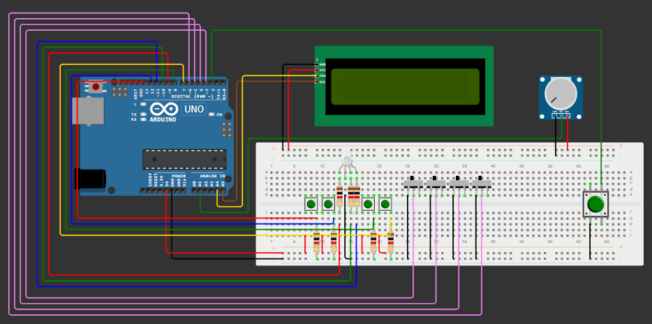

# ProyectoArduino

ProyectoArduino es un jueguito para dos: uno revisa la documentacion y el otro mete las manos *“en el fuego”*.

- **Jugador 1 (El cerebro):** abre la documentación, lee qué cables cortar y qué botones tocar.  
- **Jugador 2 (El valiente):** sigue las instrucciones, asumiendo el riesgo.  

El sistema ofrece tres mini-juegos con tres niveles de dificultad (Fácil, Medio y Difícil), cada uno con mecánicas de botones, cables y tiempos. 
Suerte! No explotes 😊

## 🤝 Integrantes Grupo Nro.7
- *Augusto Federico Zimmermann*
- *Ezequiel Di Giacomo Insua*
- *Máximo Rubén Ibarra Vargas*

## 📦 Componentes
- [1] Arduino Uno
- [1] Display LCD 16x2 I2C
- [1] Ponteciómetro []
- [5] Botones 
- [1] Led RGB
- [7] Resistencias de 330 Ω
- [Demasiados] Cables 

## 🔗 Enlaces Útiles

📄 **Consigna Proyecto Final:**  [Ver PDF](https://campusvirtualecyt.unsam.edu.ar/pluginfile.php/335293/mod_resource/content/1/Consigna%20Proyecto%20Final.pdf)

🧪 **Simulador del Proyecto:**  [Ver Simulador](https://wokwi.com/projects/434159251087922177)



## [Repositorio](https://github.com/ezequiel-digiacomo/ProyectoArduino)

**Clonar el Repositorio:**

```bash
  git clone https://github.com/ezequiel-digiacomo/ProyectoArduino.git
```


